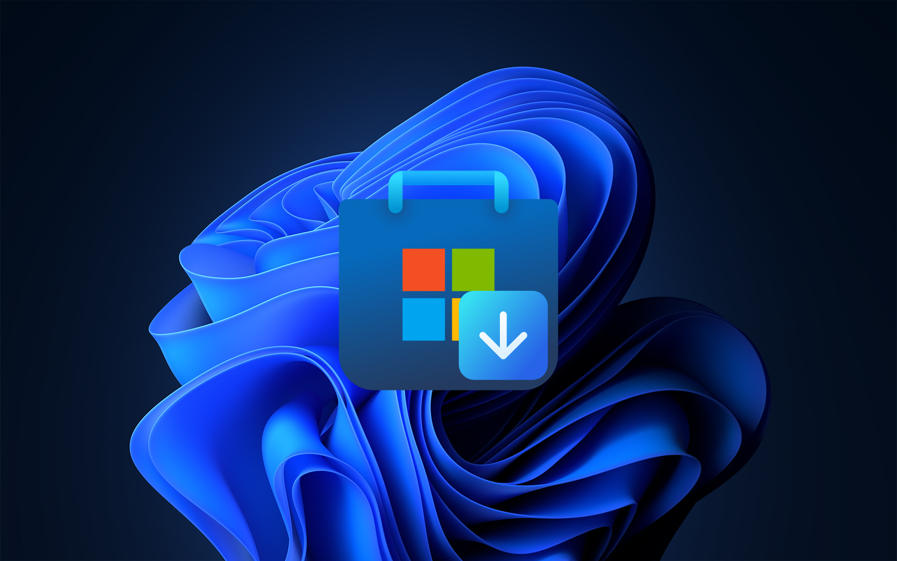

# Query Store Links

<p align="center">
  
</p>

A web UI + Cloudflare Worker that resolves Microsoft Store identifiers
(Product ID, Package Family Name, Xbox Title ID, legacy CategoryId / URL)
into direct download URLs for the underlying MSIX/APPX bundles, block maps,
and companion files.

- **Frontend** — React 19 + Vite + Fluent UI v9 (`src/`)
- **Backend** — Cloudflare Worker wrapping the `storelib_rs` resolver
  (`worker/`)
- **Hosting** — Cloudflare Workers Assets, deployed via Wrangler

## Scripts

| Script               | What it does                                                  |
| -------------------- | ------------------------------------------------------------- |
| `bun run dev`        | Vite dev server with HMR                                      |
| `bun run build`      | Type-check then build the SPA into `dist/client`              |
| `bun run preview`    | Build, then run `vite preview` against the production output  |
| `bun run deploy`     | Build, then `wrangler deploy` the Worker + assets             |
| `bun run lint`       | ESLint over the workspace                                     |
| `bun run cf-typegen` | Regenerate `worker-configuration.d.ts` from `wrangler.jsonc`  |
| `bun run assets`     | Regenerate derived icons / OG image from sources in `public/` |

## Worker subrequest budget

The built-in resolver requires **Workers Paid** for large products. FE3 makes
an upstream request for each package, plus catalog, cookie, and sync requests;
redirects also count. Products such as Realtek Audio Control (`9P2B8MCSVPLN`)
can exceed the Free plan's hard limit of 50 subrequests in one resolution.

`wrangler.jsonc` explicitly sets `limits.subrequests` to **1,000** to leave
room for those requests. This is a finite budget, not an unlimited resolver:
products with enough packages or redirects can still reach it. On Workers
Paid, adjust it to suit the workload and redeploy. See Cloudflare's
[subrequest limits](https://developers.cloudflare.com/workers/platform/limits/#subrequests)
and [Wrangler limits configuration](https://developers.cloudflare.com/workers/wrangler/configuration/#limits).

Setting this value does **not** upgrade an account or bypass the Free limit.
For a Free-plan frontend deployment, remove the `limits` block, set
`vars.DISABLE_API` to `"true"`, and configure **Settings → API Backend** to use
a separately hosted compatible resolver. Resolving large products entirely
on Workers Free would require splitting the work across client requests.

After deploying to Workers Paid, verify both JSON and streaming resolutions
of `9P2B8MCSVPLN` via `POST /api/links/resolve-all` with:

```json
{
  "ProductInput": "9P2B8MCSVPLN",
  "IdentifierType": "ProductId",
  "Market": "US",
  "Locale": "en-US",
  "Language": "en"
}
```

Use `Accept: application/json` and `Accept: application/x-ndjson`, respectively.
Confirm the final result has no `packages.fetchFailed` error and includes all
resolved packages (the issue reported 51; Microsoft's catalog can change).
Local development and deployment dry runs do not enforce the deployed
subrequest limit, so they cannot establish that the account supports this budget.

## Site assets

All public-facing images live in `public/` and are served as-is by the Worker.

### Sources (commit these directly)

| File             | Size      | Purpose                                 |
| ---------------- | --------- | --------------------------------------- |
| `favicon.svg`    | vector    | Browser favicon, in-app brand mark      |
| `qsl.png`        | 512×512   | Master for square icon variants         |
| `qsl-banner.png` | 1920×1200 | Master for the Open Graph / social card |

### Generated (run `bun run assets` to refresh)

| File                   | Size     | Wired into                              |
| ---------------------- | -------- | --------------------------------------- |
| `apple-touch-icon.png` | 180×180  | `<link rel="apple-touch-icon">`         |
| `icon-192.png`         | 192×192  | `<link rel="icon">`, webmanifest        |
| `icon-512.png`         | 512×512  | `<link rel="icon">`, webmanifest        |
| `og-image.png`         | 1200×630 | `og:image`, `twitter:image`             |
| `site.webmanifest`     | —        | `<link rel="manifest">` (hand-authored) |

The generator is `scripts/generate-assets.mjs` (uses `sharp`). All metadata
tags are declared in `index.html`.

## Project layout

```
.
├── index.html                  # SPA shell + site metadata
├── public/                     # Static assets served at site root
├── scripts/
│   └── generate-assets.mjs     # Derives icons / OG image from public/ sources
├── src/                        # React app
│   ├── App.tsx
│   ├── api.ts                  # Worker client (NDJSON streaming)
│   ├── components/
│   ├── shared.ts               # Types + identifier detection shared with worker
│   └── styles.css
├── worker/
│   └── index.ts                # Cloudflare Worker entrypoint
│                               # (resolver: @query-store-links/storelib_rs)
├── wrangler.jsonc
└── package.json
```

## License

See [`LICENSE`](LICENSE).
